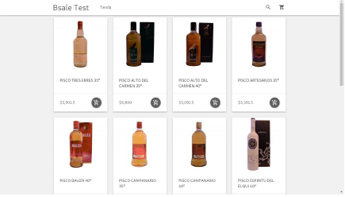
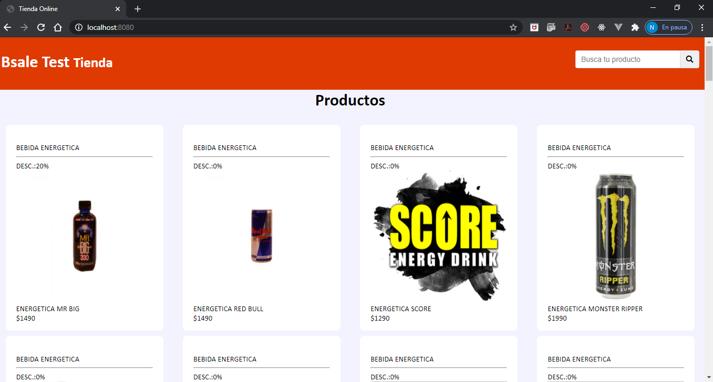
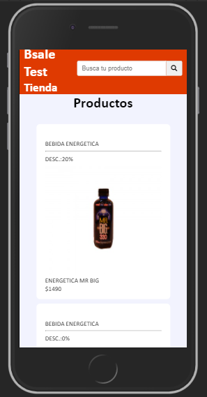

# PROYECTO FULLSTACK - Bsale

OnlineStore es un proyecto de una tienda online, en la que se despliegan los productos agrupados por categorías.

Como prototipo de baja, se utilizó la fotografía enviada por el cliente (Fig.1)

Fig.1 Prototipo

# RESULTADOS

## Vistas

Fig.2 Vista WEB

Fig.3 Vista Móbil

Herramientas
* Para el acceso a los datos de los productos se utilizó MySQL
* Vanilla Javascript 
* Node.js
